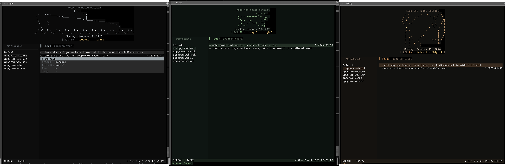

# td

Minimal todo app with a beautiful TUI, inline task syntax, and smart dashboard.

<p align="center">
  
</p>

> [!NOTE]
> If you enjoy td, give it a star and share it with your friends. That helps others find it and keeps the project going!

[](https://goreportcard.com/report/github.com/appgram/td)
[](https://opensource.org/licenses/MIT)

## Features

- **Beautiful TUI** - Clean terminal interface with multiple color schemes
- **Inline task syntax** - Add metadata while typing: `Buy milk #shopping @tomorrow !high`
- **Smart dashboard** - See today's tasks, overdue, and progress at a glance
- **Workspaces** - Organize tasks into separate workspaces
- **Subtasks** - Indent tasks to create hierarchies
- **Details panel** - View task metadata with `m` key
- **Vim-style navigation** - `j/k`, `gg`, `G`, and more
- **Multiple themes** - Switch between color schemes

## Installation

### Homebrew (macOS/Linux)

```bash
brew tap appgram/tap
brew install td
```

### Direct Download

Download pre-built binaries from the [releases page](https://github.com/appgram/td/releases):

```bash
# macOS Apple Silicon
curl -L https://github.com/appgram/td/releases/latest/download/td_darwin_arm64.tar.gz | tar xz
chmod +x td && mv td /usr/local/bin/

# macOS Intel
curl -L https://github.com/appgram/td/releases/latest/download/td_darwin_amd64.tar.gz | tar xz
chmod +x td && mv td /usr/local/bin/

# Linux x86_64
curl -L https://github.com/appgram/td/releases/latest/download/td_linux_amd64.tar.gz | tar xz
chmod +x td && sudo mv td /usr/local/bin/
```

### From Source

```bash
git clone https://github.com/appgram/td.git
cd td
make install
```

### Go Install

```bash
go install github.com/appgram/td@latest
```

## Usage

```bash
td
```
```
td -a 'Buy groceries #shopping #home @tomorrow !high'
```


### Keyboard Shortcuts

| Key | Action |
|-----|--------|
| `a` | Add new task |
| `i` | Edit task title |
| `x` / `Space` | Toggle complete |
| `dd` | Delete task |
| `j` / `k` | Navigate up/down |
| `gg` / `G` | Go to top/bottom |
| `m` | Toggle details panel |
| `>` / `<` | Indent/unindent (subtasks) |
| `h` / `l` | Collapse/expand subtasks |
| `Tab` | Switch pane |
| `:` | Command mode |
| `q` | Quit |

### Inline Task Syntax

Add metadata directly when creating tasks:

```
Buy groceries #shopping #home @tomorrow !high
```

| Syntax | Example | Description |
|--------|---------|-------------|
| `#tag` | `#work` | Add tags |
| `@date` | `@today` `@tomorrow` `@friday` `@2024-01-25` | Set due date |
| `!priority` | `!high` `!low` `!blocked` | Set priority |

**Date shortcuts:** `today`, `tomorrow`, `tmr`, `week`, `monday`-`sunday` (or `mon`-`sun`)

### Commands

| Command | Description |
|---------|-------------|
| `:due <date>` | Set due date for selected task |
| `:tag <tags>` | Add tags to selected task |
| `:priority <level>` | Set priority (high/low/normal/blocked) |
| `:clear <field>` | Clear field (due/tags/priority/all) |
| `:ws add <name>` | Create workspace |
| `:ws rename <name>` | Rename current workspace |
| `:ws delete` | Delete current workspace |
| `:dashboard` | Toggle dashboard stats |
| `:scheme <name>` | Change color scheme |
| `:scheme list` | List available schemes |
| `:help` | Show help screen |
| `:q` | Quit |

### Color Schemes

Switch themes with `:scheme <name>`:

- `default` - Dark teal/seafoam
- `black` - Pure black minimal
- `copper` - Warm copper tones
- `seafoam` - Ocean greens

## Data Storage

Tasks are stored in a SQLite database at `~/.config/td/td.db`

## Building

```bash
# Build
make build

# Install locally
make install

# Run tests
make test

# Build for all platforms
make build-all
```

## Requirements

- Go 1.21+
- macOS, Linux, or Windows

## License

MIT License - see [LICENSE](LICENSE)

## Contributing

Contributions welcome! Please open an issue or submit a pull request.
